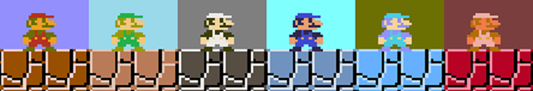

# Super Meta MarIO

## Using genetic algorithms and reinforcement learning combined to beat Mario levels.

## Preliminary Explanation

The whole concept of beating a game using code can be very confusing. This is because something like symbolic AI, Genetic Algorithms and Reinforcement Learning all look very similar when you watch a game but each method is very differnt. To help make this repo make more sense this small helper guide to explain these very elaborate theories and some problems with them are.

### Symbolic AI (Hardcoding)

The easiest way to beat Mario without using a human is with traditional AI. This can be done in two ways. The first is very simple to understand. All you have to do is hard code each input. This means everytime Mario is supposed to press right you just write a line of code that says go right. 

#### Problem (Not Actually AI)

This can also be called a TAS and has a very serious problem. There is no way to generalize this. It may be insanely accurate but has to follow a single path. This can be summed up with just a human beating the game through cheating. 

### Symbolic AI (Supervised Machine Learning)

Another way to beat Mario is through having a machine follow all your actions. This is different from hard coding inputs because there is still a neural network learning involved. A human plays the game for a long period of time and records all of their actions. Then a neural network looks at each position you were in and tries to guess what action the player did. 

#### Problem (Missing the point)

The problem isn't necessarily intuitive. For one it is very generalizable and there is still a neural network involved. However, it misses the point. If you need a human to start the initial process off then there's much better dataset that can create more useful products. Beating Mario this way has no real further use. After trained, this neural network may be able to beat several Mario games it would be unable to do any other action without several more hours of human training. Not only this but the ending result could never be better than human since that's all its doing is replicating. 

#### Example

This is an OpenCV tutorial that was able to make a self-driving car in GTAV using this method. You can click to watch the whole thing.

### Genetic Algorithms

This method is the first idea then would be useful if it could beat Mario. This would mean we could make intelligent artificial life with very simple instructions of what it was supposed to do and a lot of time. A genetic algorithm is not a hard concept to understand. Essentially, all it does is make a random set of input to output mappings. In real life an input would be any sensory data at a current time. This would incude things like touch, smell and sight. In real life an output would be any action you take in response to input. This would include typing on a keyboard or talking. In mario an input would be the current screen as bits or as an image. An output would be pressing the 'A' button or a direction key.

After each set of mappings goes through the world they are all given a score or fitness . Then, the mappings who have the highest fitness carry on to the next generation. When the next generation starts all mappings are slightly altered or mutated. This means maybe if it used to see a block and jump it now ducks instead. Some of these mutations lower the score and some raise the score. The ones who raise the score will then carry on the generation after that. This whole process is called survival of the fittest. This is dumbing down a very complicated process but that's basically it.

#### Example

[MarIO (Lua)](https://www.youtube.com/watch?v=qv6UVOQ0F44)

This whole concept is much easier explained with this video. 

#### Problem 1 (Infinte Time)

Genetic algorithms alone can technically beat anything. The catch is that it will take so much time that it could take centuries or even milleniumss. It's a lot like the monkey's on a typewriter or forming any combination using the number of pi. Any time a task starts getting too complicated it starts taking an exponential amount of time. 

#### Problem 2 (The Isolated Person Problem)

The most concrete problem even with infinite time is the concept of having a reactive machine. Imagine at input a machine spits back out the perfect buttons to press. This seems perfect and exactly in a perfect world what you would receive from a genetic algorithm. This could still not beat most games. Temporal information is very important. This is where the isolated person problem comes into play. Imagine a situation where all a character has to do is walk in a completely empty room. How, does a human in this situation know whether to go left or right. The person simply uses his past experience of which he started off as when the room wasn't empty. But, a machine that only maps inputs to outputs is unable to recall anything that happened even two seconds before this. Almost as if each organism is  in Memento or Fifty First Dates movie.

#### Example

This is same situation as described above. Without the abillity to retrain memory a genetic algorithm can't solve this problem.

#### Problem 3 (Stuck in a Valley)

Giving, a genetic algorithm hidden states is possible but usually only on a small scale. This organism can  then  write to the hidden states and track some local data. But, even with this problem solved you still can't beat Mario. This is because of a concept called Local Maximums. Imagine, a level where a user has to collect a key then enter a door. If the user doesn't collect the key then no matter what actions he does he will never do the truly best action. Even though, the algorithm may be able to spit out an organism that gets to the door extremely fast and believes it has the highest score possible. These local minimums are sometimes called valleys and are a huge problem with genetic algorithms. Often times an organism can do very well at first but will be unable to adapt to cross valleys and simply stop evolving. This concept of being very good at a very constant situation but bad elsewhere is called over-fitting.

#### Example

An example of a Local Minimum. If the fitness is judged by how far right you go, an algorithm could evolve to simply always go right and miss the optimal path.

### Reinforcement Learning
 
This is the bleeding edge solution to beating Mario. To someone who hasn't worked with them and genetic alogrithms it is very hard to tell them apart. One of the major differnces is the learning process. Most reinforcement alogrithms try to do what supervised learning has done with Symbolic AI. This is the whole concept of build test cases through a human playing the game. But, this method has no human. Instead the game plays itself almost randomly and tracks of how well it did. It then creates its own testcases to learn from. Some stratedgies even include make a model simulated enviroment so it will always know how each action effects the enviroment.

#### Problem (Stiff)

There is almost no problems with this method. It has a lot of flexiabillity and comes in a variety of shapes and sizes. Even, the things that genetic alogrithm can't solve are pretty much solved here. For one, RNN (recurrent neural networks) allow for any reinforcement alogrithm to have some sense of memory. Besides that the exploration factor of most reinforcement stratedgies allow it to cross valleys very easily. The only problem is that no matter the algorithm the lack of an input/output table means that at each set of frames an action has to be picked out. But, as far as how many frames should the jump or right button be pressed is simply not an option. This results in a Mario that looks very stiff.

#### Problem (No Free Lunch Theory)

Another way to understand deep learning is trying to make an genetic alogritm that only evolves one orgranism. While, this analogy isn't perfect it does help visualize a major problem. In this method you are tring to make a single brain try to learn everything. This means if a single outlier level pops up like a water level all the weights in the network gets shifted over. This isn't a scalable solution to solve the whole game. 

#### Example

[DQN (Python Tenserflow)](https://medium.com/emergent-future/simple-reinforcement-learning-with-tensorflow-part-0-q-learning-with-tables-and-neural-networks-d195264329d0)

This repo contains a reinforcement learning algorithm playing Mario. This explains the similar problems discussed before. It also give negative score for going left which makes for a short sighted solution to certian problems and can even cause the learning curve to be convex.

## The Theory

The whole process of reinforcement learning really is very close to the  current best solution I know of. However, my idea has a slight twist to the concept. Instead of dealing with simple actions like a or b button. Have the network pick "complicated actions". This complicated action are actually rapidly changing micro genetic algorithms. In the same way muscle memory works. Because the genetic alogrithms will be called at random times they will always start at slightly differnt places and make overfitting harder. This allows for a much more complex scalable system. However, since this no has ever done this there is almost no support for this and there is certain tricks to make this work.

## Prequisites

### Timeout Function

This idea comes from the Youtuber SethBling. In order to make a genetic algorithm evolve you have to let it play through the entire enviroment and when it is done it gets a score. This would normally mean in Mario you would have to let it play out one or three lives in its entirety. If at first the algorithm didn't even move this could take hours for a single generation. So instead SethBling decided if he knew the organism was not going anywhere and was at a stand still simply kill it off early. <b> This is concept is so important because it means an orgranism's life can end before Mario actually dies.</b>

### Simple Continous Play
 
With the timeout function in place that means even after an orgranism times out most of the time Mario is still alive. What SethBling did was just use this for speed and had the next organism start from the beginning. But, if instead you allow the next orgranism start from where the last timed out. You can create the concept Continous Play. This means again that not a single organsim has to try to beat the whole game.

#### Example

This is a good example that showcases both a timeout and what non-continous and continous play looks like. 

#### Problem (Impossible Fitness Function)

The biggest consequence of Continous Play is that you can start from anywhere. While, this prevents a lot of overfitting it also means a guy who's only good a running could be placed at a place where you need a very hard jump. Which causes a lot of randomness in the fitness. This creates to much randomness to ever evolve a complex organism. 

## The Solution Probalisitic Continous Play

To counteract this final problem. The organism can no longer be placed randomly. Instead there has to be an alogirthm that chooses where the genetic alogrithm are place. In other words a Machine Learning Alogrithm that helps a genetic alogirthm learn. This is where the whole Meta Machine Learning comes from. This alogirithm is a reinforcement alogrithm that's only goal is too score each unused orgranism and try to find the best on for the current situation. Then this orgranism will run till it times out.

### Requirements:

-Windows Enviroment

- a GPU with CUDA and CUDnn (Optional)

- [Bizhawk](https://github.com/wert23239/BizHawk) Emulator Used (Optional) 

- [Meta-MarIO](https://github.com/wert23239/Meta-MarIO) Genetic Algorithm

- Conda Requirements coming soon

